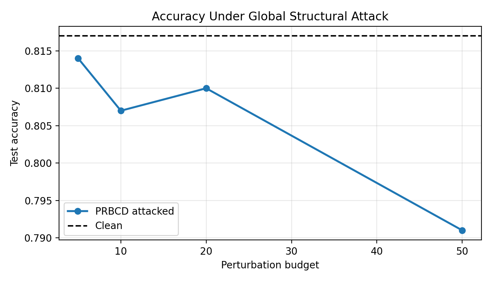
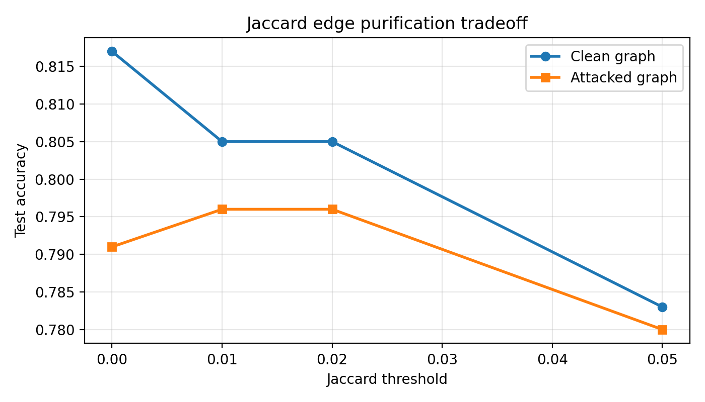
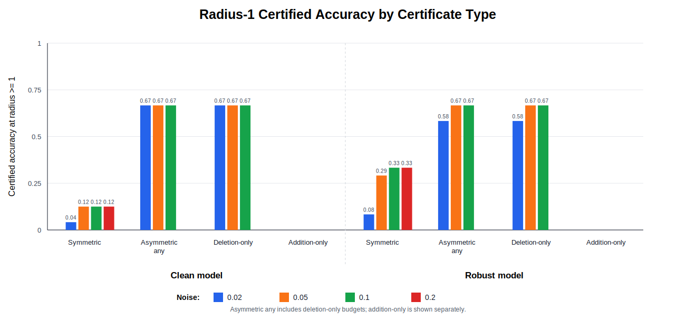
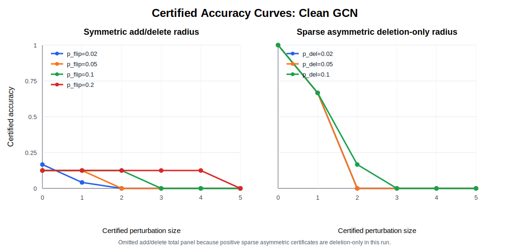
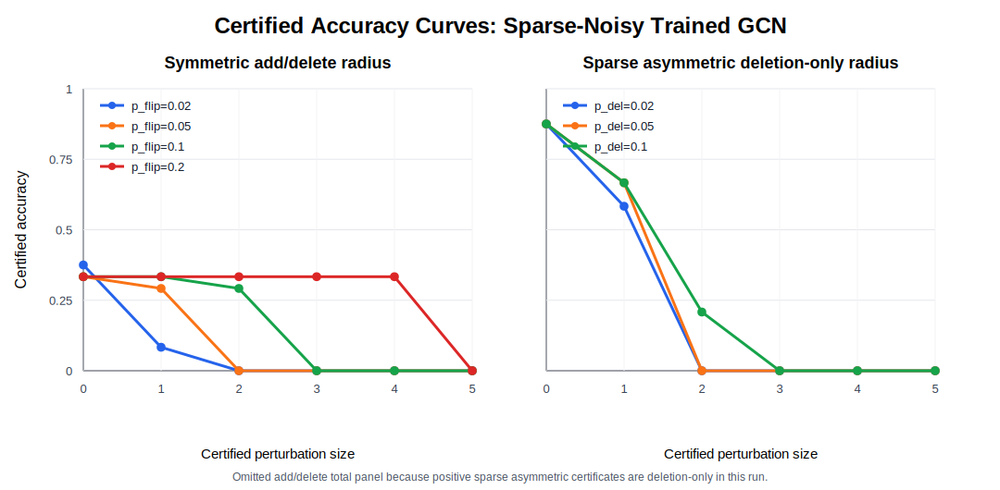
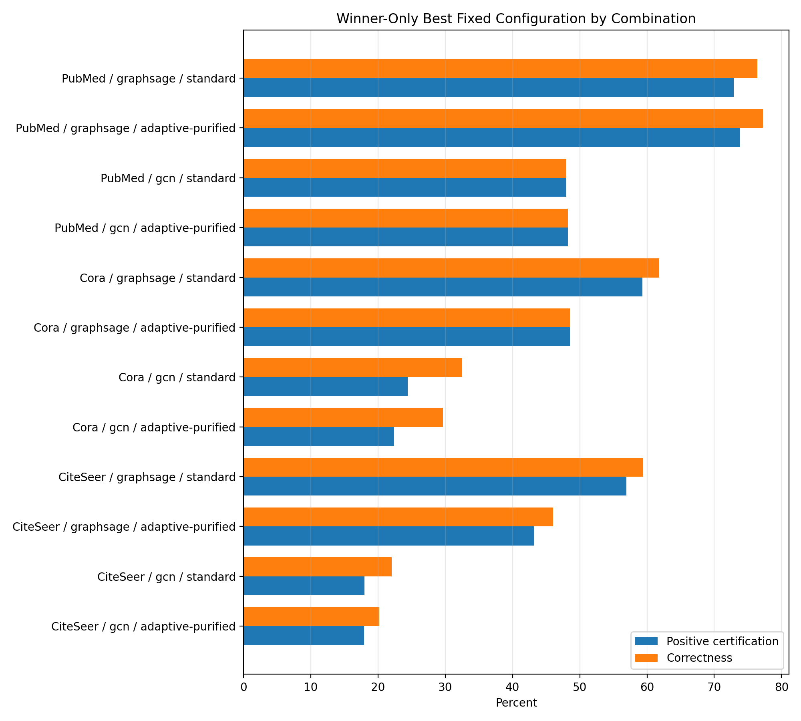
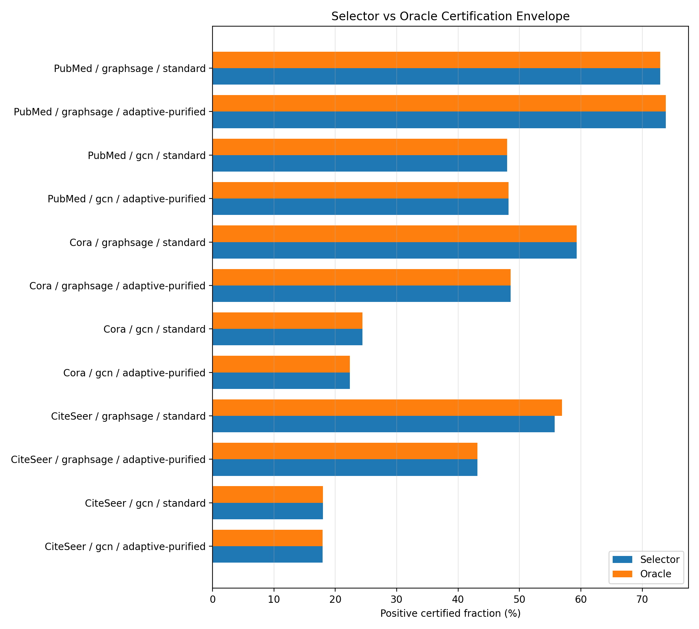
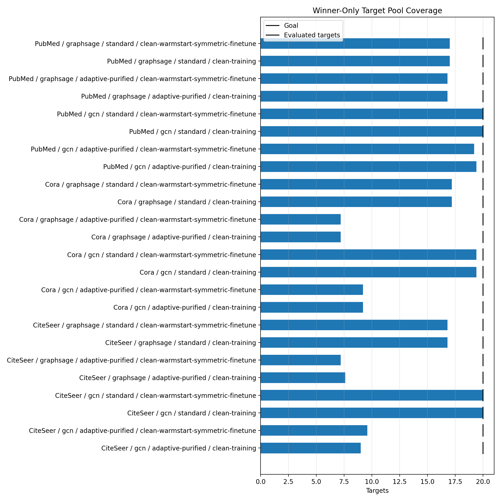

# Results

This version of the Results section embeds the current repo assets directly. The Cora baseline table, PRBCD plot, and Nettack table have been refreshed from the current validated artifacts. The Jaccard purification figure and repair table remain part of the main story. The cross-dataset winner-only benchmark figures and tables are added as the major final-results expansion beyond the earlier Cora-only report. It is also formatted for copy-paste from Markdown preview: figures use fixed display widths, and the widest tables use shorter headers or wrapped cells.

## Cora Training And Attack Baselines

| Variant | Clean | Val | Test | Smooth | Attack@50 |
|---|---:|---:|---:|---:|---:|
| clean-training | 0.817 | 0.796 | 0.817 | 0.817 | 0.791 |
| matched-sparse-noisy-training | 0.817 | 0.806 | 0.817 | 0.817 | 0.770 |
| clean-warmstart-symmetric-finetune | 0.809 | 0.798 | 0.809 | 0.809 | 0.777 |

The training-variant comparison shows that the project is not limited to a single clean baseline. In addition to the standard clean model, we evaluated matched sparse-noisy training and clean warm-start symmetric fine-tuning to test whether robustness-aligned training improves downstream behavior. On Cora, the clean and matched sparse-noisy variants both retain a clean test accuracy of 0.817, while the warm-start symmetric fine-tuning variant gives up a small amount of clean accuracy, reaching 0.809, in exchange for a training procedure that is more aligned with later certificate-oriented evaluation. The matched sparse-noisy model improves validation accuracy to 0.806, but that gain alone does not make it the strongest final defense.

These baseline results motivate the remainder of the section. Before turning to certification, we first verify that both global and targeted structural attacks are effective against the underlying GNNs, and then test whether purification can recover useful performance after those attacks.

	

*Figure. PRBCD global-attack accuracy curve from the current validated Cora results.*

The PRBCD results confirm that global structural perturbations can reduce test accuracy even when the clean model starts near 81.7 percent. As the perturbation budget increases, the attacked accuracy falls overall and reaches 79.1 percent at budget 50. Although the intermediate points are not perfectly monotone, the high-budget regime clearly shows that global edge flips degrade performance and provide a meaningful stress test for downstream defenses.

| Node | True | Clean | Attacked | Success | Perturbations |
|---|---:|---:|---:|---|---|
| 2313 | 2 | 2 | 0 | True | (2313, 2234) (2313, 2408) (2313, 2196) |
| 1922 | 0 | 0 | 3 | True | (1922, 2686) (1922, 2140) (1922, 1416) |
| 1866 | 3 | 3 | 2 | True | (1866, 919) (1866, 1744) (1866, 633) |
| 2654 | 2 | 2 | 0 | True | (2654, 2234) (2654, 2408) (2654, 403) |
| 2673 | 4 | 4 | 2 | True | (2673, 919) (2673, 1744) (2673, 2627) |

The targeted Nettack results show that local structural attacks are also effective. On the selected Cora targets, all five attacks successfully changed the model prediction away from the correct class. This matters because a defense that survives only average-case global corruption but fails on targeted manipulations would still be brittle in adversarial settings.

	

*Figure. Jaccard purification tradeoff on the clean and attacked Cora graphs.*

Jaccard-based purification provides a useful but limited recovery mechanism after global attack. Small thresholds improve the attacked graph relative to the unpurified attacked baseline, increasing attacked accuracy from 79.1 percent to 79.6 percent at thresholds 0.01 and 0.02, while reducing clean-graph accuracy from 81.7 percent to 80.5 percent. At the larger threshold 0.05, both clean and attacked performance decline, showing that overly aggressive pruning begins to remove too many informative edges.

| Thr | Attack Acc | Purified Acc | Edge Retention |
|---|---|---|---:|
| 0.00 | 0/5 | 0/5 | 1.000 |
| 0.01 | 0/5 | 3/5 | 0.337 |
| 0.02 | 0/5 | 3/5 | 0.337 |
| 0.05 | 0/5 | 4/5 | 0.140 |

The target-node repair table shows the same tradeoff at the level of attacked Nettack nodes. Without purification, none of the five targeted predictions are recovered. Thresholds 0.01 and 0.02 recover three of the five targets, while threshold 0.05 recovers four of five, but that stronger recovery comes with much lower target-edge retention. In other words, Jaccard pruning can repair targeted attacks, but the recovery is purchased by aggressively rewriting the local neighborhood around the attacked node.

Taken together, these Cora-only diagnostics establish three points. First, both global and targeted structural attacks are meaningful threats. Second, purification can partially recover attacked performance. Third, robustness claims based only on attack-free certification curves would be incomplete without first showing that the attacks themselves materially change model behavior.

## Cora Purified Certificate Results

| Variant | Best Fixed | Thr | Pos Cert | Correct | Oracle Thr | Oracle Pos Cert | Oracle Correct |
|---|---|---:|---:|---:|---:|---:|---:|
| balanced-sparse-noisy- training | symmetric-0.3 | 0.01 | 13.9% | 13.9% | 0.01 | 13.9% | 13.9% |
| clean-training | symmetric-0.3-top2 | 0.05 | 29.5% | 43.4% | 0.05 | 29.5% | 46.2% |
| clean-warmstart-symmetric- finetune | symmetric-0.3-top2 | 0.02 | 29.5% | 43.4% | 0.01 | 29.5% | 46.2% |
| matched-sparse-noisy- training | symmetric-0.3-top2 | 0.05 | 19.4% | 33.3% | 0.05 | 19.4% | 41.7% |
| purification-aware-symmetric- finetune | symmetric-0.3-cosine-top2 | 0.02 | 29.5% | 43.4% | 0.05 | 29.5% | 46.2% |

The purified-certificate comparison on Cora shows that the strongest fixed configurations come from the symmetric-0.3 family and its top-2 or cosine variants. The leading clean, warm-start, and purification-aware variants all reach roughly 29.5 percent positive certification and 43.4 percent fixed-config correctness, while oracle selection increases correctness further without materially increasing the certification ceiling. This makes Cora the clearest case study for how a deployable fixed defense compares to a best-of-candidates upper bound.

Among the Cora variants, clean-training, clean warm-start symmetric fine-tuning, and purification-aware symmetric fine-tuning form the strongest group. They all converge to essentially the same certification ceiling, while oracle selection raises correctness to about 46.2 percent by choosing better node-specific candidates. In contrast, matched sparse-noisy training remains competitive but secondary, topping out at 19.4 percent positive certification and 41.7 percent oracle correctness. Balanced sparse-noisy training is clearly weaker, reaching only 13.9 percent positive certification and 13.9 percent correctness in its best tracked row.

This comparison also clarifies the difference between deployable and exploratory evaluation. The fixed-config view is the realistic operating point because the defense is chosen in advance. The oracle view is useful as an upper envelope, but the main gain is correctness rather than certification: on the strongest Cora variants, the positive-certified fraction is already saturated by the fixed family, and the oracle mainly helps by selecting the right configuration per node.

## Certificate Diagnostics And Ablations

	

*Figure. Radius-1 certificate comparison across certificate families.*

	

*Figure. Clean GCN certificate curves used as diagnostic evidence.*

	

*Figure. Sparse-noisy trained GCN certificate curves used as diagnostic evidence.*

The older certification diagnostics function as an ablation subsection rather than the main narrative of the final Results section. Their main value is explanatory: they show why some smoothing and certificate families were retained as secondary evidence, and why the final report emphasizes the stronger symmetric and top-2 purified configurations.

At radius 1, deletion-only asymmetric certificates are substantially stronger than symmetric add/delete certificates for both the clean and robust models. This is consistent with the attack setting, since targeted structural perturbations are sparse and often align more naturally with deletion-dominated certificates. At the same time, the absence of strong addition-side certificates highlights a practical limitation of the asymmetric formulation under the current computational budget.

The clean and sparse-noisy trained GCN certificate curves tell a similar story. Certification is possible, especially at small radii, but the guarantees decay quickly as the requested perturbation size grows. Robust training improves low-radius stability, yet the resulting gains are still not large enough to displace the stronger purified symmetric family as the main deployable recommendation.

The high-addition ablation discussion should be framed carefully. High-addition smoothing regimes can increase nominal maximum radius in isolated diagnostics, but they can also sharply reduce correctness on evaluated nodes. For that reason, the validated final results treat those settings as exploratory evidence rather than as mainline defenses.

## Cross-Dataset Winner-Only Benchmark

	

*Figure. Best fixed deployable winner-only results across datasets, architectures, and attack regimes.*

To test whether the Cora trends generalize beyond a single citation graph, we ran a winner-only benchmark across Cora, CiteSeer, and PubMed, using both GCN and GraphSAGE under standard and adaptive-purified attacks. This broader view shows three consistent patterns. First, GraphSAGE dominates many of the strongest configurations. Second, PubMed produces the highest overall certification rates. Third, adaptive-purified attacks usually reduce certification relative to the corresponding standard setting.

| Dataset | Arch | Attack | Winner | Pos Cert | Correct | Max Radius |
|---|---|---|---|---:|---:|---:|
| CiteSeer | gcn | adaptive-purified | clean-training symmetric-0.3 / thr=0.01 | 17.9% | 20.2% | 4.000 |
| CiteSeer | gcn | standard | clean-warmstart-symmetric-finetune symmetric-0.3-cosine-top2 / thr=0.02 | 18.0% | 22.0% | 4.600 |
| CiteSeer | graphsage | adaptive-purified | clean-training symmetric-0.3 / thr=0.01 | 43.2% | 46.0% | 5.000 |
| CiteSeer | graphsage | standard | clean-warmstart-symmetric-finetune symmetric-0.3-cosine-top2 / thr=0.05 | 56.9% | 59.4% | 5.000 |
| Cora | gcn | adaptive-purified | clean-warmstart-symmetric-finetune symmetric-0.3-top2 / thr=0.05 | 22.4% | 29.6% | 2.400 |
| Cora | gcn | standard | clean-training symmetric-0.3-cosine-top2 / thr=0.01 | 24.4% | 32.5% | 4.000 |
| Cora | graphsage | adaptive-purified | clean-training symmetric-0.3 / thr=0.01 | 48.5% | 48.5% | 4.000 |
| Cora | graphsage | standard | clean-training symmetric-0.3 / thr=0.02 | 59.3% | 61.8% | 5.000 |
| PubMed | gcn | adaptive-purified | clean-training symmetric-0.3 / thr=0.01 | 48.2% | 48.2% | 5.000 |
| PubMed | gcn | standard | clean-training symmetric-0.3 / thr=0.01 | 48.0% | 48.0% | 5.000 |
| PubMed | graphsage | adaptive-purified | clean-training symmetric-0.3-top2 / thr=0.01 | 73.8% | 77.2% | 5.000 |
| PubMed | graphsage | standard | clean-warmstart-symmetric-finetune symmetric-0.3-top2 / thr=0.05 | 72.9% | 76.4% | 5.000 |

The strongest result in the completed benchmark is PubMed with GraphSAGE under adaptive-purified attack, where clean-training with the symmetric-0.3-top2 family at threshold 0.01 reaches 73.8 percent positive certification and 77.2 percent correctness. The corresponding PubMed GraphSAGE standard run is nearly as strong, with 72.9 percent positive certification and 76.4 percent correctness using clean warm-start symmetric fine-tuning. These two runs make it clear that the best final certification rates are no longer confined to Cora, and that the cross-dataset evaluation materially changes the scale of the final conclusions.

The benchmark also separates architectures much more strongly than the earlier Cora-only phase. On Cora, the best GCN standard result reaches 24.4 percent positive certification and 32.5 percent correctness, while the best GraphSAGE standard result reaches 59.3 percent and 61.8 percent. Similar patterns appear on CiteSeer and PubMed, where GraphSAGE consistently occupies the strongest region of the final table. This architecture gap is one of the most important additions relative to the earlier report draft.

## Selector Versus Oracle And Standard Versus Adaptive

	

*Figure. Selector-versus-oracle comparison across the completed winner-only benchmark.*

The selector-versus-oracle comparison shows that there is very little untapped certification headroom inside the current candidate family. In nearly every completed combination, the selector matches the oracle positive-certified fraction exactly or leaves only a negligible gap. The largest visible gap in the current summary is only 1.2 percentage points for CiteSeer with GraphSAGE under standard attack. This means the main challenge is not finding a dramatically better per-node candidate after the fact, but improving the underlying candidate family itself.

The standard-versus-adaptive comparison is more revealing. In most completed settings, adaptive-purified attacks reduce the best achievable certification rate. On Cora, the best adaptive GCN result is 2.1 percentage points below the best standard GCN result, and the best adaptive GraphSAGE result is 10.8 percentage points below the best standard GraphSAGE result. The same pattern largely holds on CiteSeer, where the adaptive GraphSAGE run is 13.7 percentage points below the standard GraphSAGE run. PubMed is the only case where the adaptive penalty becomes negligible or slightly positive, with adaptive GraphSAGE improving by 0.9 percentage points over the best standard result.

These comparisons sharpen the interpretation of the headline numbers. The selector already extracts almost all of the available certification headroom from the current candidate family, while adaptive attack settings remain the harder regime and usually suppress certification relative to standard attacks.

## Coverage, Failure Modes, And Remaining Gaps

	

*Figure. Target-pool coverage across winner-only benchmark combinations.*

The coverage results should be read alongside the headline certification numbers. Although the final winner-only suite is complete across datasets, many adaptive combinations did not reach the full 20-target evaluation goal. This is especially visible on CiteSeer and several GraphSAGE adaptive settings, where the pool of successful attacked targets is smaller than the intended target count. These target-pool gaps do not invalidate the completed results, but they do limit how strongly some adaptive comparisons should be interpreted.

Coverage is strongest in the standard settings and on the easier target-pool combinations, while adaptive settings tend to be bottlenecked by the availability of successful attacks. This matters methodologically because a lower evaluated-target count means the benchmark is comparing defenses on a narrower attacked subset than originally intended. The report should therefore present the target-pool figure as an explicit limitation rather than hiding it behind the summary tables.

There is a second limitation that should be stated directly: several winner configurations report strong positive-certified fractions while still having mean radius near zero in the aggregate summary. In practice, this means the benchmark is often recovering many small nonzero certificates rather than uniformly broad perturbation guarantees. The reported maximum radii are still informative, often reaching 4 or 5, but the average certificate strength is much weaker than the best-case radius suggests.

Finally, the current results support a strong conclusion about the best available defense family, but they do not close every open question. Low-noise asymmetric certificates remain unattractive in the present setup, the balanced sparse-noisy branch has not displaced the clean or warm-start symmetric baselines, and the exact reason for asymmetric collapse on purified targets is still better understood as an active diagnostic issue than as a resolved result.

## Overall Interpretation

Overall, the validated final results support a consistent conclusion. Purification and randomized smoothing can recover meaningful certified performance after structural attack, but the strongest deployable results come from a relatively small family of symmetric and top-2 configurations rather than from the more attack-aligned low-noise asymmetric branch. The cross-dataset benchmark further shows that these trends are not confined to Cora alone: the strongest certification rates appear on PubMed, and the strongest architecture-level results often come from GraphSAGE.

This is the key difference between the earlier Cora-only report and the current final picture. The earlier phase established that attacks were real and that purification and smoothing were worth studying. The final phase shows which defenses actually remain competitive after those ideas are scaled across datasets, architectures, and attack regimes. On that broader benchmark, the central practical recommendation is clear: use the symmetric purified family as the main deployable defense, treat oracle views as upper bounds, and interpret adaptive comparisons together with their target-pool coverage limitations.